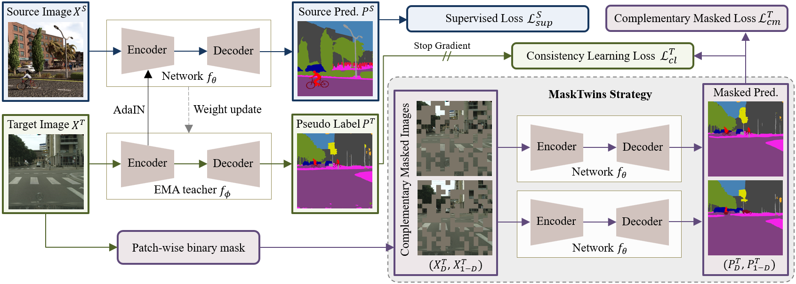

# MaskTwins: Dual-form Complementary Masking for Domain-Adaptive Image Segmentation
[[paper](https://openreview.net/pdf?id=9CpeZ8BzPO)]

**Accepted by ICML-2025**

**Jiawen Wang**<sup>1,2</sup>, Yinda Chen<sup>1,2*</sup>, Xiaoyu Liu<sup>1</sup>, Che Liu<sup>3</sup>, Dong Liu<sup>1</sup>, Jianqing Gao<sup>4†</sup>, Zhiwei Xiong<sup>1,2†</sup>

<sup>1</sup>University of Science and Technology of China (USTC), Hefei, China<br/>
<sup>2</sup>Institute of Artificial Intelligence, Hefei Comprehensive National Science Center, Hefei, China<br/>
<sup>3</sup>Data Science Institute, Imperial College London<br/>
<sup>4</sup>iFLYTEK CO., LTD<br/>
<sup>*</sup>Theory contribution, <sup>†</sup>Corresponding Author<br/>


## Abstract
Recent works have correlated Masked Image Modeling (MIM) with consistency regularization in Unsupervised Domain Adaptation (UDA). However, they merely treat masking as a special form of deformation on the input images and neglect the theoretical analysis, which leads to a superficial understanding of masked reconstruction and insufficient exploitation of its potential in enhancing feature extraction and representation learning. In this paper, we reframe masked reconstruction as a sparse signal reconstruction problem and theoretically prove that the dual form of complementary masks possesses superior capabilities in extracting domain-agnostic image features. Based on this compelling insight, we propose MaskTwins, a simple yet effective UDA framework that integrates masked reconstruction directly into the main training pipeline. MaskTwins uncovers intrinsic structural patterns that persist across disparate domains by enforcing consistency between predictions of images masked in complementary ways, enabling domain generalization in an end-to-end manner. Extensive experiments verify the superiority of MaskTwins over baseline methods in natural and biological image segmentation. These results demonstrate the significant advantages of MaskTwins in extracting domain-invariant features without the need for separate pre-training, offering a new paradigm for domain-adaptive segmentation. The source code is available at https://github.com/jwwang0421/masktwins.

## Pipeline


## Dataset Link
- [Synthia](http://synthia-dataset.net/downloads/)
- [cityscapes](https://www.cityscapes-dataset.com/downloads/)

## Training
We train the model by: 
```shell
python run_experiments.py --config configs/masktwins/synHR2csHR_CM.py
```
The entire installed python packages can be found in 'requirements.txt'.


## Acknowledgement
This project is built upon previous projects. Especially, we'd like to thank the contributors of the following github repositories:
- [MIC](https://github.com/lhoyer/MIC)
- [HRDA](https://github.com/lhoyer/HRDA)
- [DAFormer](https://github.com/lhoyer/DAFormer)
- [MMSegmentation](https://github.com/open-mmlab/mmsegmentation)
- [SegFormer](https://github.com/NVlabs/SegFormer)
- [DACS](https://github.com/vikolss/DACS)
